# Football Object Detection with YOLOv5

This project implements an Object Detection system for football match videos using the **YOLOv5** architecture. The model is trained on a high-precision dataset to support multi-task objectives, including player and ball detection, jersey number recognition, and object tracking.

---

## Video Demo

  
  
<i>Click the image above to watch the result demo on YouTube</i>

---

## Dataset Overview

### 1. Raw Dataset Characteristics
The initial raw dataset consists of video files and their corresponding annotation files:
* **Video Format**: `.mp4` (~1 minute duration, 25 FPS => **1,500 frames** per video).
* **Annotation Format**: `.json` (Provided by a professional labeling company).
* **Annotation Scope**: Integrated multi-task labels including:
    * **Object Detection**: Bounding box coordinates for players and the ball.
    * **Classification**: Player jersey number identification.
    * **Object Tracking**: Unique Tracking IDs for cross-frame entity tracking.

**Raw Folder Structure:**

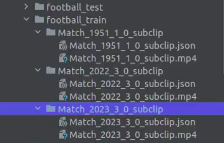

---

### 2. Preprocessing & Folder Organization
To comply with the **YOLOv5** training requirements, the raw data was processed and reorganized into the standard `images` and `labels` structure.

| YOLOv5 Requirement | Our Processed Structure |
| :--- | :--- |
| 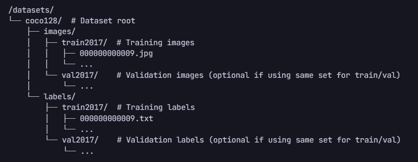 |  |

**Data Splitting (Train/Val):**
The dataset is split into training and validation sets with the following subdirectory structure:
* **Images**: `train/`, `val/` (Extracted frames from the videos).
* **Labels**: `train/`, `val/` (Generated `.txt` files for each frame).

*(Detailed sub-folder structure visualization:)*
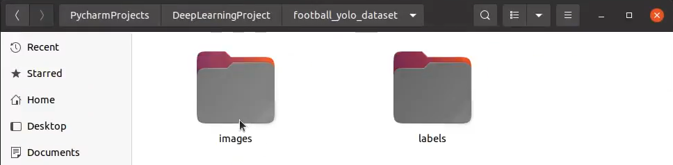 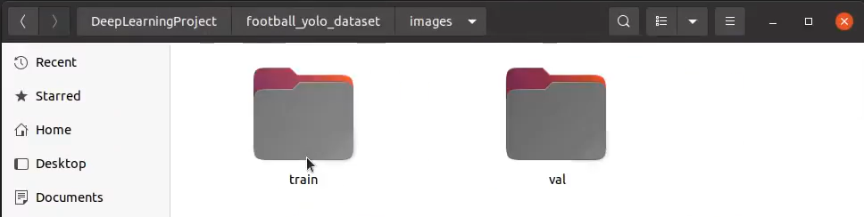 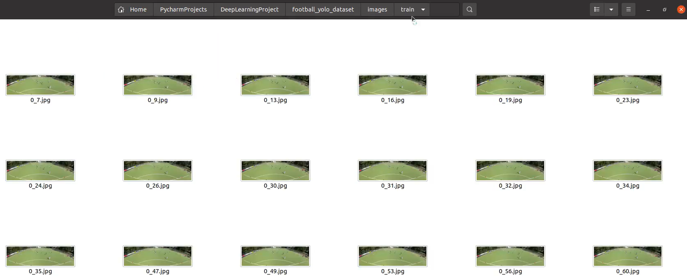 
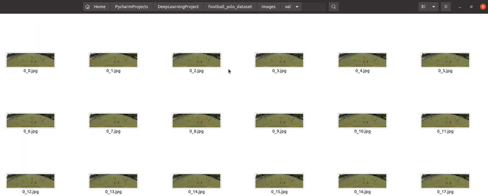 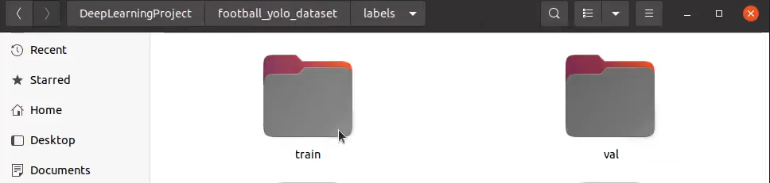 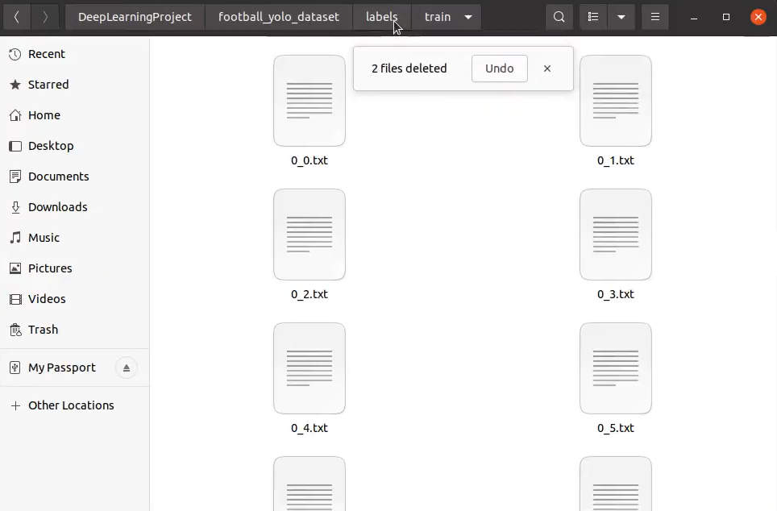 
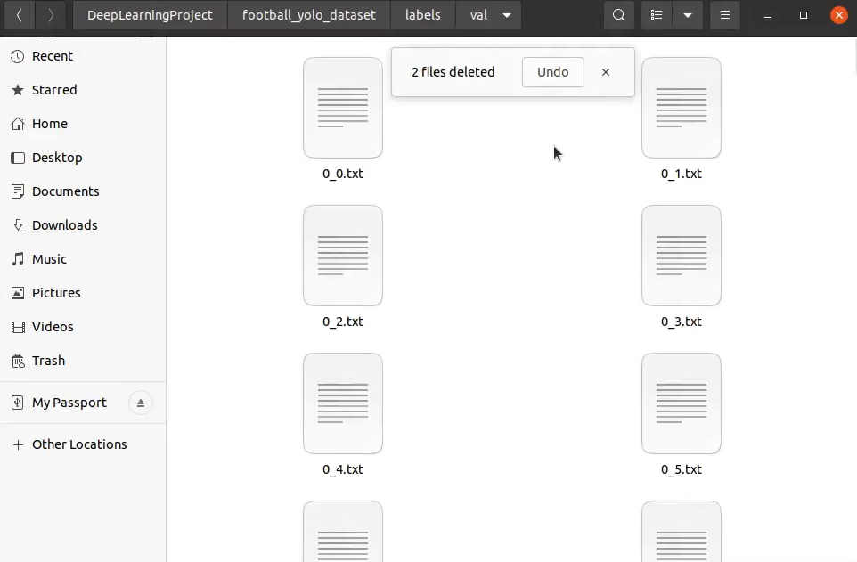

---

## Labeling Format

### YOLOv5 Standard
YOLOv5 requires one `.txt` file per image. Each line in the file represents a single object using the following format:
`class_id x_center y_center width height`
*(Note: All coordinates are normalized to the range [0, 1])*

### Label Conversion Results
Data from complex JSON files were extracted and converted into the precise `.txt` format required for model training.

**Format Comparison:**
* **System Requirement**: 
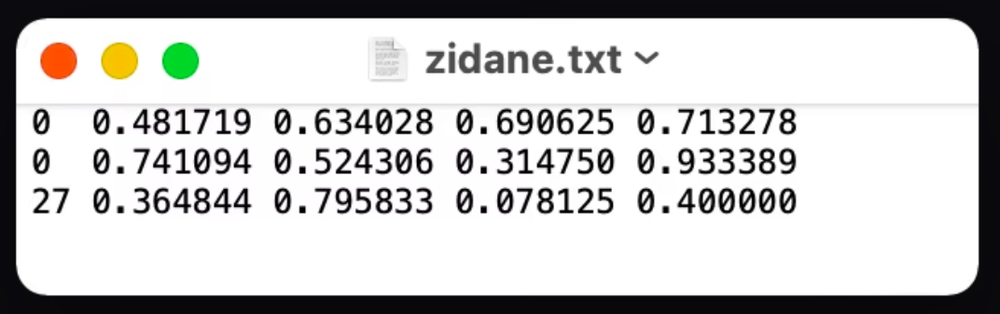
* **Actual Processed Label**:
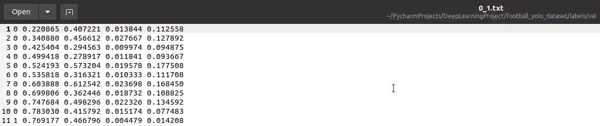

---
